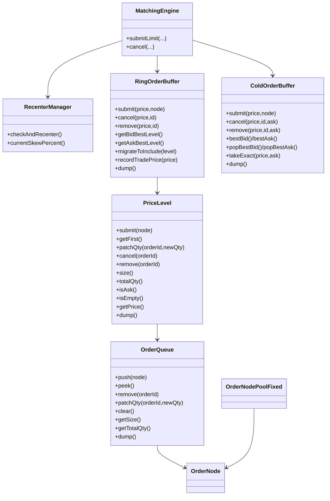
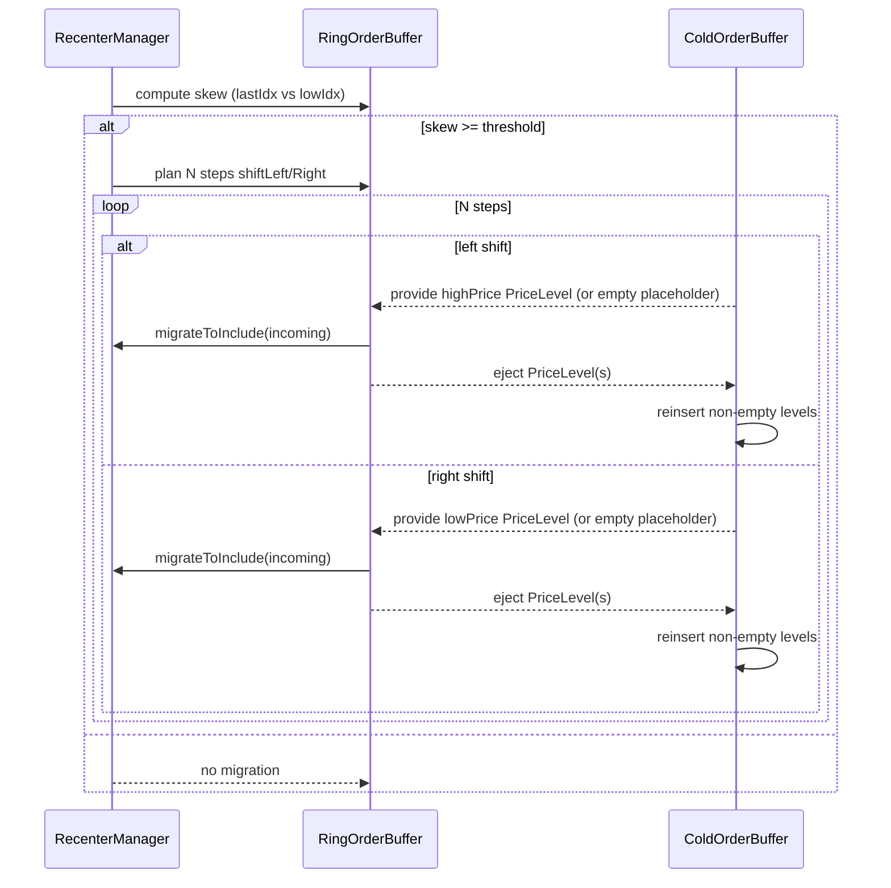
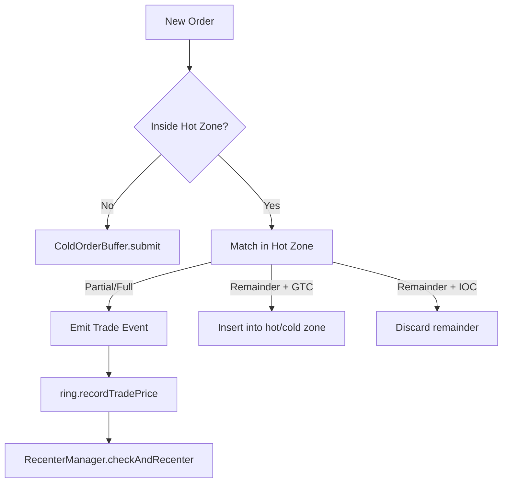

# Order Book Matching Engine

## Overview

This document describes an **order book data structure** based on a **Ring Buffer (Hot Zone)** and a **Red-Black Tree (
Cold Zone)**, designed for **high-throughput, low-latency matching** (e.g., crypto spot/futures).  
The design divides the price space into two storage regions:

- **Hot Zone**: Fixed-length (power of 2) array of `PriceLevel`, covering active price ranges. Emphasizes cache locality
  and O(1) lookup.
- **Cold Zone**: Red-Black Trees (`TreeMap`) for prices far from the current range. Emphasizes ordered queries and O(log
  N) operations.

By **dynamic migration** between zones and **re-centering**, the system balances performance, memory efficiency, and
robustness.

---

## Core Components

### 1) `OrderNode`

- Represents a single order, acts as a node in a linked list.
- Fields: `orderId`, `userId`, `ask` (true = ASK/sell, false = BID/buy), `qty`, `time`, `prev/next`.
- Allocated/recycled via **`OrderNodePoolFixed`** to reduce GC overhead.

### 2) `OrderNodePoolFixed`

- Fixed-capacity object pool (uses `ArrayDeque` for cache locality).
- Overflow handled by direct `new`; overflowed objects left to GC.
- Provides stats: pool usage, overflow count, peak usage.

### 3) `OrderQueue` (**Queue inside each price level**)

- **Doubly-linked list + HashMap** (`orderId → node`) for O(1) `peek/push/remove/patchQty`.
- FIFO: append at tail, consume from head → price-time priority.
- Aggregation: `size`, `totalQty`, `dump()` for inspection.

### 4) `PriceLevel`

- A single price + single side (ASK/BID).
- Contains one `OrderQueue`.
- APIs: `submit`, `getFirst`, `patchQty`, `cancel`, `remove`, `isEmpty`, `size`, `totalQty`, `dump`.
- Direction consistency ensured (no mixing ASK/BID inside).

### 5) `RingOrderBuffer` (**Hot Zone**)

- Power-of-2 length array of `PriceLevel`, index wrap-around via `mask = length-1`.
- State: `lowIdx/highIdx`, `lowPrice/highPrice`, `lastIdx/lastPrice`.
- APIs:
    - Insert/cancel/remove: `submit(price,node)`, `cancel(price,id)`, `remove(price,id)`
    - Best price: `getBidBestLevel()` (scan down from `lastIdx`), `getAskBestLevel()` (scan up)
    - Migration: `shiftLeft(level)` / `shiftRight(level)` (single step), `migrateToInclude(level)` (multi-step)
    - Diagnostics: `dump()`
- **Index ↔ Price mapping is exact**; migration always uses a non-null `PriceLevel` (possibly empty placeholder).

### 6) `ColdOrderBuffer` (**Cold Zone**)

- Backed by two `TreeMap<Long, PriceLevel>`:
    - `asks` (ascending)
    - `bids` (descending)
- Stores only **non-empty** levels.
- APIs:
    - Submit/cancel/remove: `submit`, `cancel`, `remove`
    - Best: `bestAsk/bestBid`, `popBestAsk/popBestBid`
    - Exact fetch: `takeExact(price,ask)`
    - Monitoring: `dump`, `sizeAsks/sizeBids`, `vacuum()`

### 7) `RecenterManager`

- Keeps hot zone **balanced around `lastIdx`**.
- Skew = `(lastIdx - lowIdx) / (length-1) * 100%`; ideal center = 50%.
- Threshold-based migration:
    - Deviation ≥10% → 1 step, ≥20% → 2 steps, ≥30% → 3 steps, ≥40% → 4 steps.
- Each step triggers **hot/cold migration**:
    - Left shift: import `highPrice` level, eject `lowPrice` level.
    - Right shift: import `lowPrice` level, eject `highPrice` level.

### 8) `MatchingEngine`

- Orchestrates all components; single-threaded matching.
- Supports **LIMIT + {GTC, IOC}**:
    - Match inside hot zone first.
    - Remaining GTC → insert into hot/cold zone (depending on price).
    - Remaining IOC → discarded.
- Trade price = passive side price.
- After each trade: update `ring.recordTradePrice(price)` and `recenter.checkAndRecenter()`.

---

## Component Relationship (with `OrderQueue`)

Hot/Cold Migration Sequence

