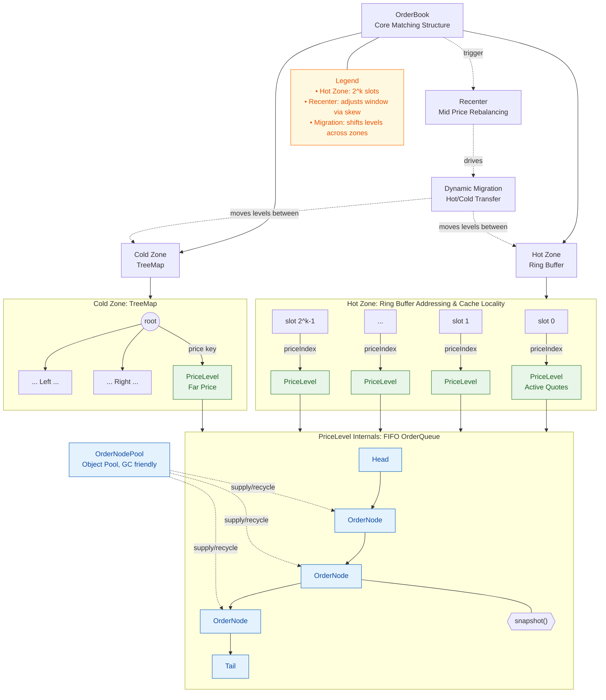
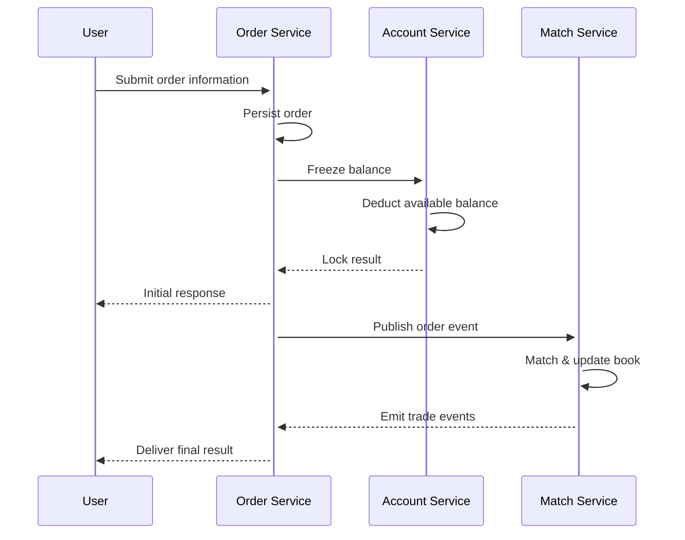
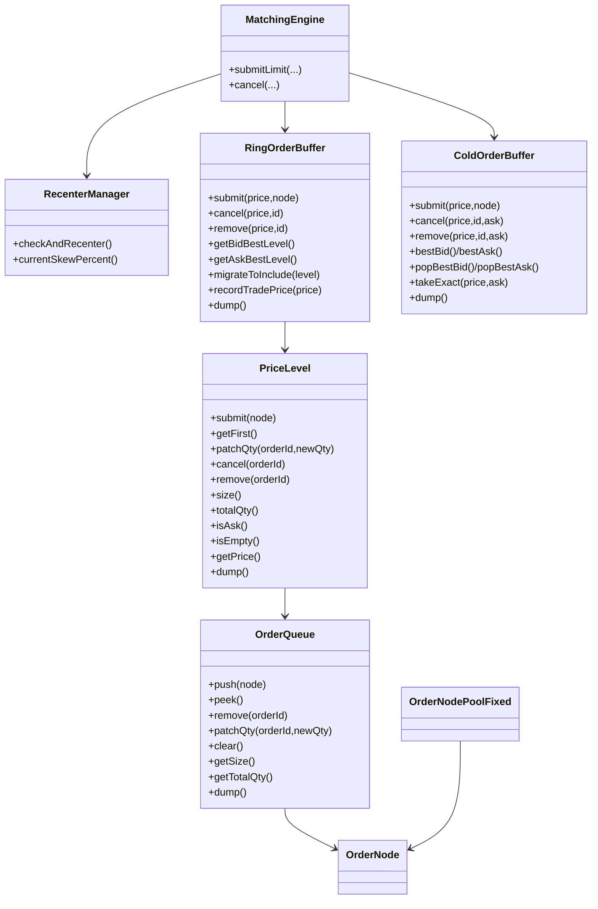

# Match Engine

A high-performance matching core focused on limit/market order books, ultra-low-latency matching, and WAL + snapshot
persistence. The project balances architectural clarity and extensibility, making it a solid baseline for digital asset
exchanges, quantitative trading desks, or distributed matching prototypes.

## Project Overview

- **Core features**: single-threaded matcher + dual-zone order book (RingBuffer + TreeMap), automatic mid-price
  recentering, support for LIMIT/MARKET orders with IOC/FOK time-in-force, and durable recovery through write-ahead
  logging and snapshots.
- **Tech stack**: Spring Boot WebFlux, Disruptor event loop, R2DBC MySQL, optional Redis integration, plus a minimal
  `trade.html` for instant hands-on testing.
- **Use cases**: spot and derivatives exchanges, simulation labs, low-latency research, and benchmarking of matching
  algorithms.
- **Time to first trade**: run `mvn spring-boot:run`, then use Swagger or curl samples to submit, cancel, and match
  orders within minutes.

### Keywords / Tags

`matching engine`, `order book`, `limit order book`, `IOC`, `FOK`, `crypto exchange`, `high throughput`, `low latency`,
`ring buffer`, `red-black tree`, `WAL`, `snapshot`, `order queue`, `matching algorithm`, `recenter`,
`dynamic migration`, `spring webflux`, `disruptor`

---

## Architecture & Data Structure Highlights

### Dual-Zone Order Book Topology

The order book separates hot and cold price levels to leverage CPU cache locality while preserving balanced-tree
ordering:



**Data Structure Highlights**

- **Hot Zone**: power-of-two RingBuffer delivers O(1) access to active price levels with tight cache locality—ideal for
  high-frequency matching.
- **Cold Zone**: TreeMap (red-black tree) stores less active quotes while preserving total ordering and O(log N)
  operations.
- **Dynamic Migration**: `RecenterManager` samples trade prices, calculates skew, and triggers hot/cold migration to
  keep the window centered.
- **PriceLevel**: each price holds a FIFO `OrderQueue` supporting `submit/remove/patchQty/dump`, while
  `OrderNodePoolFixed` recycles nodes to minimize GC overhead.

### Order Flow & Component Relationships

End-to-end order flow from REST endpoint to matching thread:



Class-level overview:



---

## Data Backup & Recovery

Snapshots and WAL enable precise recovery without pausing the matching thread. The system follows a single-writer plus
shadow-copy model:

- **Snapshot strategy**: a background thread bumps `snapEpoch`, waits for in-flight writes to finish, then scans object
  pools. Any object mutated after `t0` stores a pre-image in `ShadowPool`.
- **Consistency guarantees**: matching continues uninterrupted; `lastMutEpoch` values and shadow copies ensure the
  snapshot captures a strongly consistent view at time `t0`.
- **Recovery workflow**: load the latest snapshot → replay WAL files under `data/wal` starting from the snapshot
  timestamp → rebuild the book exactly as it was.
- **I/O timeline**:

```mermaid
sequenceDiagram
    autonumber
    participant W as Writer Thread
    participant C as Controller (SnapCtl)
    participant S as Snapshot Thread
    participant O as Entry
    participant P as ShadowPool

    Note over C: Trigger snapshot → prepare phase
    C->>C: prepare=true
    W->>O: Finish in-flight writes
    W->>W: activeWrite=false

    Note over C: Start snapshot at t0
    C->>C: snapEpoch++ ; snapshotInProgress=true
    S->>S: Begin scanning

    Note over W: New writes after t0
    W->>P: putIfAbsent old image
    W->>O: Mutate entry
    W->>W: activeWrite=false

    rect rgb(245,245,245)
    Note over S: Snapshot thread prefers shadow copies
    S->>P: Lookup shadow
    P-->>S: Return old image
    S->>S: Persist snapshot view
    end

    S-->>C: Snapshot completed
    C->>C: snapshotInProgress=false
```

> Tip: snapshots live in `data/snapshots/`, while WAL logs live in `data/wal/`. Customize paths through
`application.yml` as needed.

---

## Quick Start

1. **Install prerequisites**
    - JDK 11+
    - Maven 3.8+
    - MySQL 8.x (default DSN `r2dbc:pool:mysql://localhost:3306/test`, username/password `test`)
    - Optional Redis at `localhost:6379` for event extensions

2. **Bootstrap the service**

   ```bash
   mvn clean package            # optional: compile + run tests
   mvn spring-boot:run          # or java -jar target/match-engine-*.jar
   ```

   Expected logs:

   ```
   api doc  : http://localhost:8080/webjars/swagger-ui/index.html
   homepage : http://localhost:8080/trade.html
   ```

3. **Validate the APIs**
    - Open `http://localhost:8080/trade.html` to place and cancel demo orders.
    - Use Swagger UI to explore REST endpoints.
    - WAL files appear under `data/wal`, snapshots under `data/snapshots`.

---

## Frequently Used APIs

| Method | Path                | Description                                   |
|--------|---------------------|-----------------------------------------------|
| POST   | `/api/order`        | Submit LIMIT/MARKET orders and receive fills. |
| POST   | `/api/order/cancel` | Cancel by `symbol + orderId + price`.         |
| GET    | `/api/order/trades` | Fetch the latest trade events.                |

Order submission example:

```bash
curl -X POST http://localhost:8080/api/order \
  -H 'Content-Type: application/json' \
  -d '{
    "userId": 1001,
    "orderId": 90000001,
    "symbol": 1,
    "side": 0,
    "type": 0,
    "tif": 0,
    "qty": 100000,
    "price": 300000
  }'
```

Field reference: `side` (0=Bid, 1=Ask), `type` (0=LIMIT, 1=MARKET), `tif` (0=GTC, 1=IOC, 2=FOK reserved), `qty/price`
use integer scales.

Cancel example:

```bash
curl -X POST http://localhost:8080/api/order/cancel \
  -H 'Content-Type: application/json' \
  -d '{
    "userId": 1001,
    "orderId": 90000001,
    "symbol": 1,
    "side": 0,
    "type": 0,
    "tif": 0,
    "qty": 0,
    "price": 300000
  }'
```

---

## Project Layout

```
match-engine/
├── src/main/java/icu/match
│   ├── Main.java                # Spring Boot entrypoint
│   ├── core/                    # Matching core: order book, engine, WAL, snapshot
│   ├── service/                 # Disruptor events, matcher bindings
│   └── web/                     # WebFlux controllers & DTOs
├── src/main/resources
│   ├── application.yml          # Service & datasource configuration
│   └── static/trade.html        # Minimal frontend
├── data/
│   ├── wal/                     # Write-ahead logs (order stream)
│   └── snapshots/               # Order book snapshots
└── README.md
```

---

## Development & Testing Tips

- Run `mvn test` to execute core matching unit tests; add coverage for extreme spreads and batch cancels when extending
  logic.
- To integrate MQ/Redis, subscribe to events under `src/main/java/icu/match/service/disruptor` and fan them out to
  external systems.
- For production, complement the engine with account management, risk controls, latency monitors, and observability
  pipelines.
- Performance tuning: size the RingBuffer per symbol activity and customize recenter thresholds/steps in
  `RecenterManager`.

---

## Contribution & References

- Contributions are welcome—issues and pull requests that improve the matching engine, order book, or snapshot pipeline
  are appreciated.
- For the original Chinese documentation, see `README.md`; legacy English notes remain in `README.en.md`.
- If this project helps you, please Star ⭐ the repo so more developers can discover a high-performance matching engine
  implementation.

