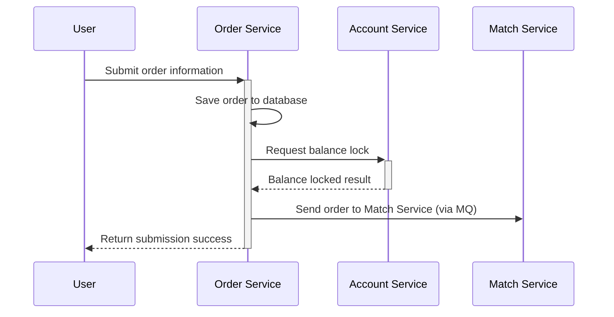
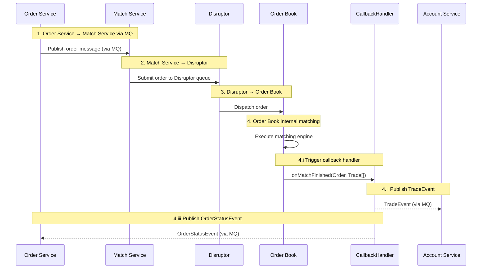
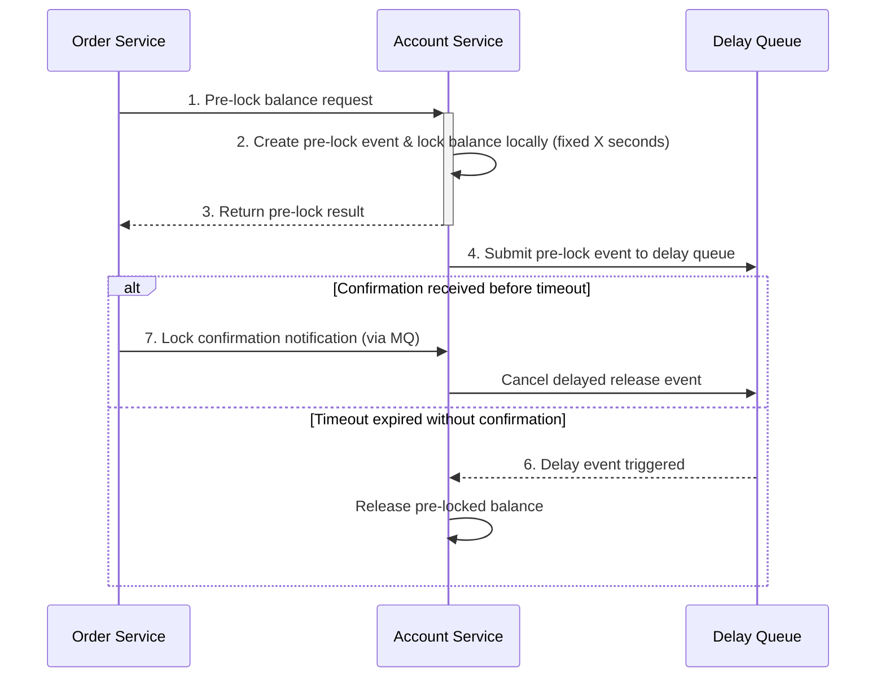

# 1.基本设计

## 1.用户下单链路图

## 2.撮合流程图

1. 订单服务通过MQ将订单推送到撮合服务
2. 撮合服务消费订单信息将其提交到Disruptor同步队列
3. Disruptor队列消费处理器处理将订单提交到订单簿
4. 订单簿内部撮合后产生Order和Trade数据
   1. 将撮合后数据通过撮合回调处理器处理
   2. 将Order和Trade组装为撮合事件通过MQ推送到账户服务更新余额
   3. 将Order和Trade组装为撮合事件通过MQ推送到订单服务更新订单状态

## 3.余额自动释放机制

1. 订单服务向账户服务提交锁余额请求
2. 账户服务接收到锁余额请求
3. 生成预锁事件 将余额短时锁定固定秒数
4. 返回预锁定结果
5. 将预锁事件提交到延时队列 延时处理
6. 如果到期未接收到订单服务提交的锁定通知 释放锁定的余额
7. 订单服务锁定通知
   1. 订单服务在做完余额锁定和订单入库后
   2. 需要向账户服务通过MQ发送一条通知 要求长期锁定该部分余额知道订单被撮合或取消

## 4.订单簿数据结构

订单簿数据具有以下特点

订单数量和访问频率大致以当前价格为中心呈正态分布，且靠近市价的订单簿价格具有连续性

顾可将数据分为靠近市价的热区和远离市价的冷区

冷区用两个红黑树

热区用环形数组+双向链表+哈希存储

环形数组每个元素以价格为索引 价格最小步长为间距 并指向一个双向链表

每个双向链表存储当前价格下的所有订单

只需维护头节点用于get 尾节点用于插入

其他操作通过orderId->Node 的hash来进行

冷热区数据具有自平衡机制

# 2.详细设计

