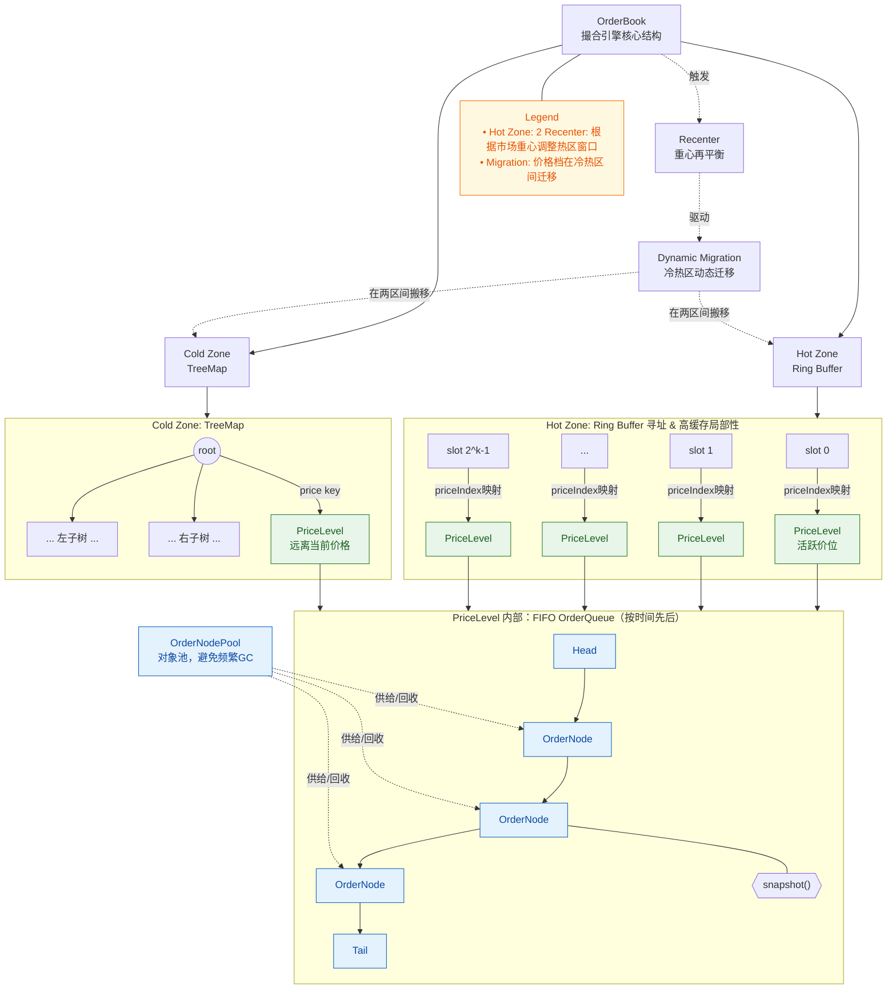
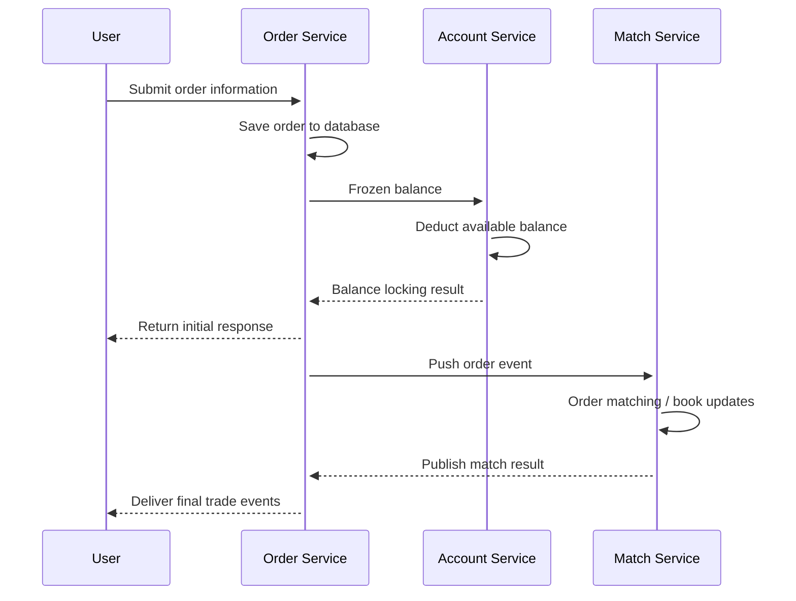
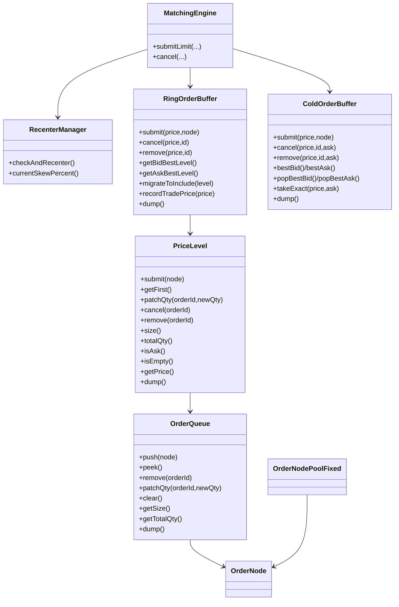
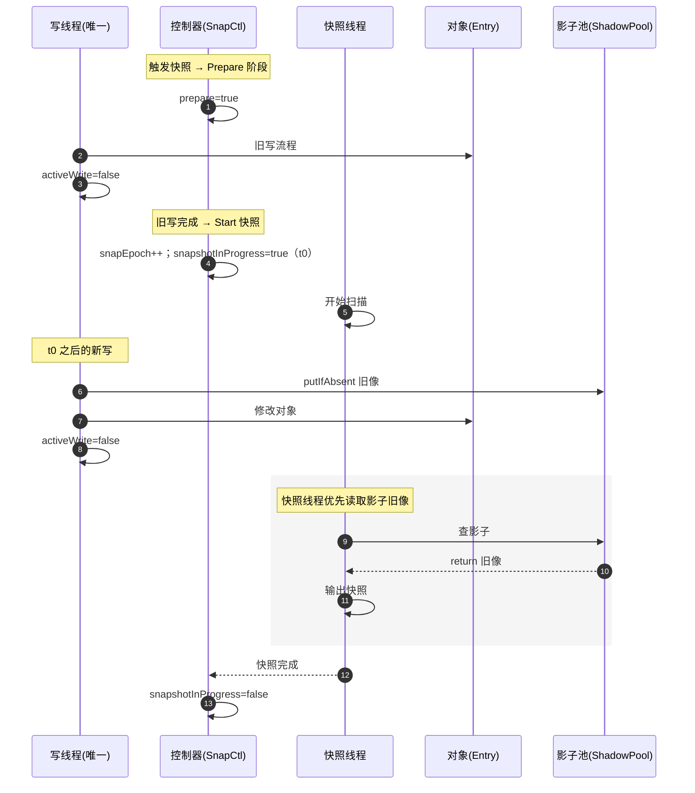

# 撮合引擎 Match Engine

高性能撮合核心，专注于限价 / 市价订单簿、低延迟撮合、快照与 WAL 持久化。项目兼顾架构可读性与二次开发体验，适合作为数字资产交易所、量化撮合模块或分布式撮合原型的基线实现。

## 项目总览

- **核心特性**：单线程撮合 + 冷热双区订单簿（RingBuffer + TreeMap），自动重心再平衡，支持 LIMIT/FOK IOC 市价撮合，写前日志与快照保证恢复能力。
- **技术栈**：Spring Boot WebFlux、Disruptor 事件驱动、R2DBC MySQL、可选 Redis 扩展；静态页面 `trade.html` 用于快速体验。
- **应用场景**：数字货币交易所、衍生品撮合、模拟撮合教学、低延迟撮合实验、撮合算法 Benchmark。
- **快速上手**：`mvn spring-boot:run` 即可启动，Swagger + Curl 示例帮助你在 3 分钟内打通下单、撤单、撮合全流程。

### 关键词 / Tags

`matching engine`, `order book`, `limit order book`, `IOC`, `crypto exchange`, `高性能撮合`, `低延迟`, `环形缓冲`,
`红黑树`, `WAL`, `snapshot`, `订单簿`, `撮合算法`, `order queue`, `recenter`, `dynamic migration`, `spring webflux`,
`disruptor`

---

## 架构与数据结构亮点

### 双区订单簿拓扑

核心订单簿采用冷热区分层存储，充分利用 CPU cache locality 与红黑树的有序检索，动态图解如下：



**数据结构要点**

- Hot Zone：固定长度 2^n RingBuffer，O(1) 定位当前活跃价位，Cache 友好，适配 高频撮合 / HFT 场景。
- Cold Zone：TreeMap（红黑树）承载远离重心的价位，保证有序检索与 O(logN) 复杂度。
- Dynamic Migration：RecenterManager 通过成交价序列计算偏移，触发冷热区迁移与窗口重心再平衡。
- PriceLevel：内部是 FIFO OrderQueue，支持 `submit/remove/patchQty/dump`，并通过 `OrderNodePoolFixed` 复用节点，最大限度削减
  GC.

### 业务链路与组件关系

用户下单从接口到撮合线程的调用时序：



核心类图概览：



---

## 数据备份与恢复

使用“单写线程 + 影子快照”的组合模型，在不中断撮合线程的情况下生成点时快照，并配合 WAL（Write-Ahead Log）实现精确恢复。
详情见
https://ychen5325.notion.site/26316248953d80ffb884edb31a91bc27

读写并行时序图

- **快照策略**：后台线程按需触发 `snapEpoch`；在 Prepare 阶段确保旧写完成，再开始扫描对象池。每个在 `t0` 之后写入的对象会先复制旧像到
  ShadowPool。
- **一致性保障**：快照不会阻塞撮合线程；通过 `lastMutEpoch` 与影子副本确保输出的是 `t0` 时刻的强一致状态。
- **恢复流程**：加载最新快照 → 从快照时间戳开始回放 `data/wal` 下的 WAL 日志 → 恢复到拍摄点后的完整状态。
- **读写流示意**：



> 提示：快照文件默认写入 `data/snapshots/`，WAL 落盘在 `data/wal/`。自定义路径可以在 `application.yml` 中调整。

---

## 快速开始

1. **安装依赖**

   - JDK 11+
   - Maven 3.8+
   - MySQL 8.x（默认 `r2dbc:pool:mysql://localhost:3306/test`，账号/密码 `test`）
   - Redis 可选（`localhost:6379`，用于扩展事件流）

2. **启动服务**

   ```bash
   mvn clean package            # 可选：编译 + 单元测试
   mvn spring-boot:run          # 或 java -jar target/match-engine-*.jar
   ```

   启动后输出：

   ```
   api doc  : http://localhost:8080/webjars/swagger-ui/index.html
   homepage : http://localhost:8080/trade.html
   ```

3. **验证接口**
   - 浏览器访问 `http://localhost:8080/trade.html`，体验下单 / 撮合。
   - Swagger UI 调试 REST API。
   - `data/wal` 记录成交写前日志，`data/snapshots` 存储订单簿快照。

---

## 常用 API

| Method | Path                | 描述                                |
|--------|---------------------|-----------------------------------|
| POST   | `/api/order`        | 提交限价单 / 市价单，返回撮合结果与成交事件。          |
| POST   | `/api/order.bin`    | 字节流下单。                            |
| POST   | `/api/order/cancel` | 根据 `symbol + orderId + price` 撤单。 |
| GET    | `/api/order/trades` | 拉取最新成交列表。                         |

下单示例：

```bash
curl -X POST http://localhost:8080/api/order \
  -H 'Content-Type: application/json' \
  -d '{
    "userId": 1001,
    "orderId": 90000001,
    "symbol": 1,
    "side": 0,
    "type": 0,
    "tif": 0,
    "qty": 100000,
    "price": 300000
  }'
```

字段说明：`side` (0=买,1=卖)、`type` (0=LIMIT,1=MARKET)、`tif` (0=GTC,1=IOC,2=FOK[预留])，`qty/price` 使用整数刻度。

撤单示例：

```bash
curl -X POST http://localhost:8080/api/order/cancel \
  -H 'Content-Type: application/json' \
  -d '{
    "userId": 1001,
    "orderId": 90000001,
    "symbol": 1,
    "price": 300000
  }'
```

---

## 目录结构

```
match-engine/
├── src/main/java/icu/match
│   ├── Main.java                # Spring Boot 启动入口
│   ├── core/                    # 撮合内核：订单簿、撮合逻辑、WAL、Snapshot
│   ├── service/                 # Disruptor 事件、撮合线程绑定
│   └── web/                     # WebFlux 控制器与请求模型
├── src/main/resources
│   ├── application.yml          # 数据源 & 引擎配置
│   └── static/trade.html        # 最小化前端页面
├── data/
│   ├── wal/                     # 写前日志（订单流）
│   └── snapshots/               # 订单簿快照
└── README.md
```

---

## 开发与测试建议

- 使用 `mvn test` 运行撮合单元测试；建议在新增撮合策略时覆盖极端价差、批量撤单等场景。
- 扩展 MQ/Redis：在 `src/main/java/icu/match/service/disruptor` 中订阅撮合事件即可对接外部撮合撮出。
- 若部署生产环境，请配合账户服务、风控、延迟补偿、全链路监控等模块。
- 性能调优：根据交易对活跃度动态调整 RingBuffer size，或在 `RecenterManager` 中定制偏移阈值与步进策略。

---

## 贡献指南 & 参考

- 欢迎提交 Issue/PR，一起完善 `matching engine`, `order book`, `snapshot` 相关实现。
- 英文介绍请参阅 `README.en.md`；更多架构细节可以参考作者笔记（见 `README.md` 原文链接）。
- 如果本项目对你有帮助，请在 GitHub Star ⭐ 支持，帮助更多开发者发现这套高性能撮合引擎。

