# 1.基本设计

## 1.用户下单链路图

## 2.撮合流程图

1. 订单服务通过MQ将订单推送到撮合服务
2. 撮合服务消费订单信息将其提交到Disruptor同步队列
3. Disruptor队列消费处理器处理将订单提交到订单簿
4. 订单簿内部撮合后产生Order和Trade数据
    1. 将撮合后数据通过撮合回调处理器处理
    2. 将Order和Trade组装为撮合事件通过MQ推送到账户服务更新余额
    3. 将Order和Trade组装为撮合事件通过MQ推送到订单服务更新订单状态

## 3.余额自动释放机制

1. 订单服务向账户服务提交锁余额请求
2. 账户服务接收到锁余额请求
3. 生成预锁事件 将余额短时锁定固定秒数
4. 返回预锁定结果
5. 将预锁事件提交到延时队列 延时处理
6. 如果到期未接收到订单服务提交的锁定通知 释放锁定的余额
7. 订单服务锁定通知
    1. 订单服务在做完余额锁定和订单入库后
    2. 需要向账户服务通过MQ发送一条通知 要求长期锁定该部分余额知道订单被撮合或取消

## 4.订单簿数据结构

订单簿数据具有以下特点

订单数量和访问频率大致以当前价格为中心呈正态分布，且靠近市价的订单簿价格具有连续性

顾可将数据分为靠近市价的热区和远离市价的冷区

冷区用两个红黑树

热区用环形数组+双向链表+哈希存储

环形数组每个元素以价格为索引 价格最小步长为间距 并指向一个双向链表

每个双向链表存储当前价格下的所有订单

只需维护头节点用于get 尾节点用于插入

其他操作通过orderId->Node 的hash来进行

冷热区数据具有自平衡机制

# 2.详细设计

## 1.订单簿数据结构设计

# 订单簿撮合引擎 (Order Book Matching Engine)

## 概述

本文档描述了一套基于 **环形数组（Ring Buffer）** 与 **冷区红黑树（TreeMap）**
的订单簿数据结构设计与实现，面向高吞吐、低延迟的撮合场景（如数字货币现货/合约）。  
设计将价格空间划分为两类存储：

- **热区（Hot Zone）**：使用固定长度（2 的幂）的环形数组，承载活跃价位，强调缓存局部性与 O(1) 寻址。
- **冷区（Cold Zone）**：使用红黑树（`TreeMap`）承载远离当前价格的低频价位，强调有序性与 O(log N) 操作。

通过 **冷热区动态迁移** 与 **重心再平衡（Recenter）**，系统在保障撮合性能的同时兼顾内存利用率与稳定性。

---

## 核心组件

### 1) `OrderNode`

- 单个订单节点；在队列中作为链表节点存在。
- 关键字段：`orderId`、`userId`、`ask`（true=卖/ASK、false=买/BID）、`qty`、`time`（单调时钟）、`prev/next`。
- 由 **对象池** `OrderNodePoolFixed` 统一分配与回收，降低 GC 压力。

### 2) `OrderNodePoolFixed`

- 固定上限的对象池（使用 `ArrayDeque` 提升缓存局部性）。
- 池满时允许**溢出 new** 以应对极端峰值；释放溢出对象交给 GC。
- 提供统计：在池使用数、溢出分配次数、历史峰值等。

### 3) `OrderQueue`（**价位内订单队列**）

- **双向链表 + Hash 索引（orderId → node）**，O(1) `peek/push/remove/patchQty`。
- FIFO：尾插、头取，满足价格优先下的时间优先撮合规则。
- 聚合统计：`size`、`totalQty`；`dump()` 方便排查。

### 4) `PriceLevel`

- **单一价格 + 单一方向** 的容器；内部持有一个 `OrderQueue`。
- 对外暴露价位维度操作：`submit`、`getFirst`、`patchQty`、`cancel`、`remove`、`isEmpty`、`size`、`totalQty`、`dump`。
- 方向 `ask` 由入队首单决定（建议非空状态禁止跨侧订单混入）。

### 5) `RingOrderBuffer`（**热区**）

- 固定长度为 **2 的幂** 的 `PriceLevel[]`，索引环绕（`mask = length-1`）。
- 状态：`lowIdx/highIdx`（窗口边界）、`lowPrice/highPrice`（对应价格）、`lastIdx/lastPrice`（最近成交价位）。
- 操作：
    - 入/撤/删：`submit(price,node)`、`cancel(price,id)`、`remove(price,id)`
    - 查询最优：`getBidBestLevel()`（从 `lastIdx` 向低价扫描）、`getAskBestLevel()`（向高价扫描）
    - 迁移：`shiftLeft(level)` / `shiftRight(level)`（单步）、`migrateToInclude(level)`（跨多档）
    - `dump()` 可视化
- 约束：**数组索引与价格一一对应**；迁移时**参数价位不得为 null**，若为空位则以“同价的空 `PriceLevel`”占位。

### 6) `ColdOrderBuffer`（**冷区**）

- `TreeMap<Long, PriceLevel>` 各一棵：`asks`（升序）、`bids`（降序）。
- 只存**非空**价位（空位不入树，避免膨胀）。
- 能力：
    - 提交/撤单/删除：`submit`、`cancel`、`remove`
    - 最优：`bestAsk/bestBid`、`popBestAsk/popBestBid`
    - 价位转移：`takeExact(price,ask)`（取且删，可能为 null）
    - 监控：`dump()`、`sizeAsks/sizeBids`、`vacuum()`

### 7) `RecenterManager`

- **热区重心再平衡**：计算 `lastIdx` 相对 `lowIdx` 的位置比（0%..100%，50% 为理想中心）。
- 偏离度分档（默认 10%/档，最多 4 次/调用）：
    - 偏离 ≥10% → 1 步；≥20% → 2 步；≥30% → 3 步；≥40% → 4 步。
- 每步执行一次冷热交换（左移：引入 `highPrice` 处价位；右移：引入 `lowPrice` 处价位），逐出档位回灌冷区。

### 8) `MatchingEngine`

- 绑定上述组件，单线程撮合。
- 支持 **LIMIT + {GTC, IOC}**：
    - 在热区内先撮合；剩余 GTC → 热/冷区入簿（取决于价格是否在热区），IOC → 余量丢弃。
- 成交价为被动方价位；每次成交后调用 `ring.recordTradePrice(price)` 与 `recenter.checkAndRecenter()`。

---

## 组件关系（含 `OrderQueue`）

```mermaid
classDiagram
    class MatchingEngine {
        +submitLimit(...)
        +cancel(...)
    }
    class RecenterManager {
        +checkAndRecenter()
        +currentSkewPercent()
    }
    class RingOrderBuffer {
        +submit(price,node)
        +cancel(price,id)
        +remove(price,id)
        +getBidBestLevel()
        +getAskBestLevel()
        +migrateToInclude(level)
        +recordTradePrice(price)
        +dump()
    }
    class ColdOrderBuffer {
        +submit(price,node)
        +cancel(price,id,ask)
        +remove(price,id,ask)
        +bestBid()/bestAsk()
        +popBestBid()/popBestAsk()
        +takeExact(price,ask)
        +dump()
    }
    class PriceLevel {
        +submit(node)
        +getFirst()
        +patchQty(orderId,newQty)
        +cancel(orderId)
        +remove(orderId)
        +size()
        +totalQty()
        +isAsk()
        +isEmpty()
        +getPrice()
        +dump()
    }
    class OrderQueue {
        +push(node)
        +peek()
        +remove(orderId)
        +patchQty(orderId,newQty)
        +clear()
        +getSize()
        +getTotalQty()
        +dump()
    }
    class OrderNode
    class OrderNodePoolFixed

    MatchingEngine --> RingOrderBuffer
    MatchingEngine --> ColdOrderBuffer
    MatchingEngine --> RecenterManager
    RingOrderBuffer --> PriceLevel
    PriceLevel --> OrderQueue
    OrderQueue --> OrderNode
    OrderNodePoolFixed --> OrderNode
```

冷热区迁移时序

撮合工作流（简化）

--- 

